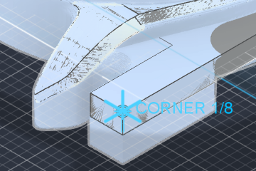
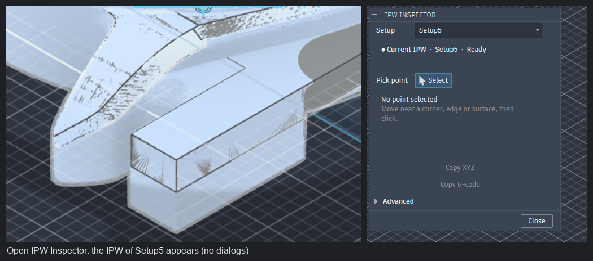
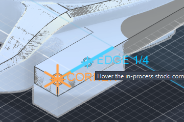

# Fusion IPW Inspector

Click a point on the in-process stock (IPW) of any Manufacturing Setup in Autodesk Fusion and read
its X, Y, Z in that setup's work coordinate system. Corners, edges and flat faces of the stock snap
like CAD geometry, so you do not have to hit an STL vertex.



## 1. What IPW Inspector Does

- Adds one button, **IPW Inspector**, to the Inspect panel of the Manufacture workspace.
- Fetches the current in-process stock of the setup by itself (through Fusion's post engine, no
  Save Stock dialog) and shows it as a translucent, edge-free overlay in the viewport.
- While you hover the stock it previews what a click will pick: a **CORNER** (three planes), an
  **EDGE** (two planes) or a **SURFACE** (one plane). The features are extracted once per stock from
  the full-resolution mesh and snapping is magnetic: a corner is acquired within the tolerance and
  held until the cursor clearly leaves it. Internal STL triangle edges are never offered as edges.
- **Show IPW** hides the stock overlay instantly to compare with the clean model; snapping data
  stays loaded.
- A click gives the feature type and its X/Y/Z in the WCS of the selected setup, with the fit
  residual and a confidence label. **Copy XYZ** and **Copy G-code** put the numbers on the clipboard.
- Closing the dialog removes the overlay and every marker; nothing is saved into your document.

## 2. Demo



| CORNER snap | EDGE snap |
|-------------|-----------|
|  |  |

Both pictures are the real watch-case job (Setup5, rotary). The cursor is next to the corner, not on
the vertex; the cyan cross marks the reconstructed corner, the cyan line the reconstructed edge.

## 3. Installation

Windows, about two minutes, no administrator rights.

1. Download `FusionIPWInspector-v0.4.1.zip` from the
   [releases page](https://github.com/arashsajjadi/fusion-ipw-inspector/releases).
2. Extract it. You get a folder `FusionIPWInspector` containing `FusionIPWInspector.py` and
   `FusionIPWInspector.manifest`.
3. Copy that folder into Fusion's user add-ins folder. Paste this into the Explorer address bar:

   ```
   %APPDATA%\Autodesk\Autodesk Fusion 360\API\AddIns
   ```

   The result must be `...\AddIns\FusionIPWInspector\FusionIPWInspector.py`. Create the `AddIns`
   folder if it does not exist yet.
4. Start Fusion (or, if it is running, open **Utilities > Add-Ins > Scripts and Add-Ins**, tab
   **Add-Ins**, select *FusionIPWInspector*, click **Run**).
5. Tick **Run on Startup** in the same dialog so the button is there every time.
6. Open the **Manufacture** workspace. The button is in the **Inspect** panel of every Manufacture
   tab (next to Measure).

**Optional installer.** From the extracted release folder:

```powershell
powershell -ExecutionPolicy Bypass -File .\install.ps1
```

It copies the add-in into the folder above, prints the installed version, and touches nothing else.
`install.ps1 -Uninstall` removes it. Manual copying always works too.

**Updating.** Extract the new ZIP and copy the `FusionIPWInspector` folder over the old one (or run
`install.ps1` again). Restart Fusion or stop and run the add-in in Scripts and Add-Ins.

**Uninstalling.** Stop the add-in in Scripts and Add-Ins, then delete
`%APPDATA%\Autodesk\Autodesk Fusion 360\API\AddIns\FusionIPWInspector`. The add-in's own data lives in
`%LOCALAPPDATA%\FusionIPWInspector` (preferences, cache, diagnostics log) and can be deleted as well.
The helper post `ipw_inspector_stock.cps` in your personal post folder is a plain text file and is
safe to delete.

macOS: the add-ins folder is `~/Library/Application Support/Autodesk/Autodesk Fusion 360/API/AddIns/`.
The code has no Windows-only dependency, but macOS has not been tested.

## 4. 30-Second Quick Start

1. In Manufacture, select the setup you care about (or just have the document open) and click
   **IPW Inspector**.
2. Wait a moment. The status line reads **● Current IPW · Setup5 · Ready** and the stock appears in
   the viewport. Nothing else pops up. (The first time a stock is seen its snap features are
   prepared in the background for a few seconds; afterwards they load from a cache in 0.2 s.)
3. Move the mouse near a corner, edge or face of the stock. A cyan marker previews the feature
   (`CORNER 1/8`, `EDGE 2/4`, `SURFACE`). Press **N** to cycle to another candidate at the same spot.
4. Click. The panel shows the feature and X / Y / Z in the setup's WCS.
5. **Copy XYZ** (tab separated) or **Copy G-code** (`X2.078 Y25.150 Z22.000`). A short
   "XYZ copied" note confirms it.
6. Change the **Setup** dropdown to read the same kind of point in another setup's WCS; the
   right IPW is fetched automatically.
7. Untick **Show IPW** to see the clean model where the stock was; tick it to bring the stock back.
8. **Close**. The overlay is gone.

## 5. Selecting Corners, Edges and Surfaces

The snap works on the stock mesh itself; no model geometry is needed.

- **Tolerance is screen-space.** Everything within 12 pixels of the cursor is considered, so the
  snap feels the same zoomed in or out (0.02 mm to 5 mm search radius, converted through the
  current camera).
- **Precomputed features.** When a stock is loaded, its triangles are clustered into planar
  patches (10° / 0.05 mm per cell, merged across cells), adjacent patches at 20° or more give
  edges (clipped to where the faces really meet), and three mutually adjacent, well-conditioned
  patches give corners. This runs once in the background (about 4 s for the 829 000-triangle
  watch-case stock) and is cached next to the exported stock, so a hover only asks "which cached
  corner, edge or patch is nearest the cursor?" Both corners of one tab use the same fitted
  planes, so their shared coordinates are identical. Until the features are ready, a local
  reconstruction around the cursor is used as a fallback.
- **Rejections.** Near-parallel planes, ill-conditioned three-plane intersections, patches too
  narrow to be a machined face (fillet strips) and features away from where the faces meet are
  dropped. Because a plane is one cluster of coplanar triangles, the diagonals of a tessellated
  flat face never appear as edges.
- **Magnetic ranking.** Candidates are ordered CORNER > EDGE > SURFACE > RAW. A feature is acquired
  when it is within the tolerance and held until the cursor is two tolerances away; a higher
  priority feature within the tolerance takes over, a same-priority one only when it is clearly
  closer. The preview never alternates on one- or two-pixel motion.
- **Cycling.** Press **N** while hovering to step through the candidates (`2/8`, `3/8`, ...). Your
  choice sticks until the cursor leaves that feature. (Tab also works when the viewport owns the
  keyboard focus, but the dialog normally consumes Tab for its own controls.)
- **Confidence** comes from real metrics: the RMS residual of the plane fits, the number of
  supporting triangles and the conditioning of the intersection. `high`, `medium`, `low` or
  `raw surface hit`; the raw numbers are in Advanced.
- **Model geometry.** Tick *Allow model selection* under Advanced to also pick faces, edges,
  vertices, sketch and construction points of the model. Such readings are labelled `MODEL` and
  are exact; IPW readings are labelled `IPW`.
- **Markers** use shape and label, not colour alone: cross for CORNER, line for EDGE, diamond for
  SURFACE, dot for RAW; cyan while previewing, orange once picked.

## 6. Coordinate Accuracy

`Setup.workCoordinateSystem` is the setup-to-world rigid transform (translation in mm regardless of
document units). A picked world point `p` becomes `p_setup = Rᵀ · (p − origin)` after the matrix has
been checked to be a proper right-handed rigid transform. No machine kinematics are involved: for a
rotary setup the WCS is simply a WCS whose X axis happens to be the rotary axis.

Numbers show 3 decimals in mm, 4 in inches, with an explicit sign and never `-0.000`.

What limits the accuracy is the stock itself: Fusion computes the in-process stock at the setup's
stock accuracy (the watch-case stock has a 0.18 mm mean triangle edge). A reconstructed CORNER or
EDGE is the intersection of planes fitted to that mesh, so on a tessellated flat face it lands on
the true face plane (residual 0.000 mm on the watch-case tabs). On a curved or scalloped area the
fit residual tells you how far to trust it, and the RAW hit is always available.

## 7. Validation

All figures below were measured on the installed v0.3.0 build, Fusion 2.0.2705x (2705.1.15).

**Real watch-case job, Setup5 (rotary, WCS X along world +Z).** Expected values come from the stock
STL that Fusion itself exports for the setup, analysed independently with NumPy (planar patches and
their intersections). The cursor was placed 0.4–0.6 mm away from the corner in each case.

| Feature | Expected (Setup5 WCS, mm) | Measured | Error | Method / residual / cursor distance |
|---------|---------------------------|----------|-------|--------------------------------------|
| tab corner A (outer, top) | 2.0776 / 25.150 / 22.000 | 2.0776 / 25.1500 / 22.0000 | 0.0000 | 3-plane, residual 0.0000 mm, 0.561 mm from hit |
| tab corner B (opposite end) | 2.0776 / −25.150 / 22.000 | 2.0776 / −25.1500 / 22.0000 | 0.0000 | 3-plane, residual 0.0000 mm, 0.480 mm from hit |
| corner D (under the rail) | 2.0776 / 25.150 / 17.920 | 2.0776 / 25.1500 / 17.9212 | 0.0012 | 3-plane, residual 0.0003 mm, 0.402 mm from hit |
| tab top edge | x = 2.0776, z = 22.000 (line) | 2.0776 / 19.9322 / 22.0000 | 0.0000 off the line | 2-plane, residual 0.0000 mm, 0.238 mm from hit |
| tab flat face | z = 22.000 (plane) | 0.1661 / 19.9322 / 22.0000 | 0.0000 off the plane | plane fit, residual 0.0000 mm |
| edge chosen with N after a corner preview | x = 2.0776, z = 22.000 (line) | 2.0776 / 24.6757 / 22.0000 | 0.0000 off the line | 2-plane, residual 0.0000 mm |

Corner D's 0.0012 mm is the tessellation of the underside plane (its triangles lie between
z = 17.919 and 17.921 in the exported file).

**Analytic synthetic job** (`tools/validate_in_fusion.py`, 17 checks, all pass): a 40 × 30 × 20 mm
block with a 20 × 10 × 8 mm pocket; Setup 2 uses the preceding stock with its WCS at (−1, −1, 21).
Pocket floor at z = 12.000, outline at the model box, exported part within 0.0000 mm of the model,
placed mesh transform equal to the setup WCS, world → setup → world round trip exact.

**Unit tests** (79, pure Python, run anywhere): transform, units, STL reading, mesh validation, the
local snapping core (plane fitting on noisy/irregular tessellations, edge and corner
reconstruction, rejection of near-parallel and ill-conditioned cases, suppression of internal
triangulation edges, candidate ordering, hysteresis, cycling, screen-space tolerance), the feature
graph (patches, all edges and corners of a box, a tab on a plate, shared planes between corners,
fillet strips rejected), the ray cast and the magnetic tracker rules.

```bash
python -m unittest discover -s FusionIPWInspector/tests -v
```

**Self test** inside Fusion (Advanced > Run self test): transform cases, unit conversion, rejection
of bad matrices, every setup's WCS, and for the loaded stock: readable, scale plausible, encloses
the model, orientation of the exported part, fits the setup stock box.

**Lifecycle and window tests** on the installed build: 10 monitored launches (every top-level window
of the Fusion process sampled every 25 ms) showed only the shortcut search box, the inspector dialog
and a tooltip, no transient window; 10 open/close cycles, cancel with Escape, setup switching,
add-in reload while open, a document switch while open, and a wrong stock file all ended with 0
temporary components and 0 custom graphics groups in the document. `tools/lifecycle_test.py`
repeats the acquire/remove cycle inside Fusion and checks the counts and the cache folder.

**Performance** (watch-case Setup5 stock, 828 912 triangles, measured inside Fusion on the
installed 0.4.0 build; 0.3.0 numbers for comparison):

| Step | 0.4.0 | 0.3.0 |
|------|-------|-------|
| stock export through the post engine | 0.33 s | 0.33 s |
| mesh import into the viewport | 2.1–2.3 s | 2.0–2.4 s |
| dialog build | 0.015 s | 0.016 s |
| snap index (uniform grid, 47 063 cells of 0.41 mm), background | 1.27 s | 1.27 s |
| feature graph (54 881 patches, 2 555 edges, 1 056 corners), background, once per stock | 4.25 s | – |
| snap cache load on later opens (after a reload or restart) | 0.16 s | – |
| hover: our work per event (ray 0.08 + cast 0.03 + tolerance 0.12 + query 0.07 + track 0.02 + marker 1.9 ms) | 2.3 ms median, 7.6 ms p95 with the repaint | 17.7 ms median |
| viewport repaint per hover | ≤ 60 Hz, 5 ms when it runs | 7.2 ms every event |
| hover events per second the pipeline sustains | 170 (5.8 ms median interval) | 56 (saturated) |
| additional memory (offline measurement) | +127 MB retained, +337 MB peak while building | +79 MB / +156 MB |

## 8. How It Works

Fusion still has no public API call that returns the in-process stock (build 2.0.2705x; the
investigation of 40 avenues is in [docs/RESEARCH.md](docs/RESEARCH.md)). It does export the setup
stock and the part as STL for any post processor that asks for them (`this.exportStock = true`),
the mechanism the shipped machine-simulation posts use. For a *From preceding setup* setup that
stock **is** the in-process stock.

So the add-in ships a tiny post (`resources/post/ipw_inspector_stock.cps`) that writes no NC code.
Clicking the button installs it into your personal post folder if missing, creates a temporary NC
program for the setup, posts it into the add-in's cache folder, reads the exported stock, deletes the
NC program again, and imports the stock as a component named **"IPW Inspector temporary stock (not
saved, safe to delete)"** placed with the setup's WCS. Unchanged stock is reused.

Two representations of the stock exist. The **analysis mesh** is the full-resolution exported STL,
kept in memory with a uniform grid and the feature graph; every coordinate comes from it. The
**display mesh** is the same file imported as a non-selectable temporary component: Fusion only
draws it. Hovering never asks Fusion what is under the cursor: the mouse position becomes a ray
through the camera, the ray is cast against the analysis mesh (grid traversal, 0.03 ms), the
screen tolerance is converted to millimetres at that depth, and the cached features around the
hit are ranked. The marker is one set of persistent custom-graphics groups that are moved through
their transforms, never recreated; viewport repaints are limited to 60 Hz. Investigated and
rejected: decimating the display mesh (Fusion's own cost per mouse move is small once the body is
not selectable) and converting the stock to STEP (no accuracy or speed benefit for a tessellated
stock). See [docs/SNAPPING.md](docs/SNAPPING.md) for the algorithms, the rejection rules and the
complexity analysis.

Fusion behaviours that shape the command: graphics drawn in `executePreview` are discarded before
the next preview and may survive the command's end, so every group is tagged and swept once the
dialog has closed; a preview requested from inside a hover event cancels the click that follows;
the stock overlay must be rejected in `preSelect` and left out of the selection filter, or Fusion pre-highlights it on every move; and
a light-bulb change made inside the dialog's own event does not stick, so **Show IPW** is applied
from an idle event. Document changes (acquisition, reference points) run in a dialog-less command
after which the dialog reopens with its state.

```
FusionIPWInspector/
  FusionIPWInspector.py         run()/stop(): toolbar button, commands, save hook
  commands/
    inspector_command.py        the dialog, hover/pick handling, lifecycle
    snap_controller.py          hover hit -> mesh frame, screen-space radius, index cache
    actions_command.py          document changes as one undo step, dialog resume
    self_test_command.py        hidden self test
  core/                         pure Python, no Fusion imports
    mesh_index.py               uniform-grid triangle index (float32, chunked build), ray cast
    features.py                 patches, edges and corners of a stock, coarse-cell lookup, cache state
    snap.py                     local reconstruction (fallback), magnetic tracker
    transform.py                SetupFrame: WCS matrix -> world/setup transform
    point_inspector.py          readings, rounding, copy formats
    stock_file.py               STL reading, unit and frame inference
  stock/                        providers, temporary mesh, validation, per-document session
  ui/                           toolbar.py, marker.py (tagged custom graphics)
  diagnostics/                  log.py (quiet by default), self_test.py
  utils/                        prefs.py, clipboard.py, fusion_units.py
  resources/                    icons, marker icons, post/ipw_inspector_stock.cps
  tests/                        unit tests
tools/validate_in_fusion.py     analytic validation (run inside Fusion)
tools/lifecycle_test.py         acquire/remove cycles and cleanup counts (run inside Fusion)
```

## 9. Troubleshooting

- **No button.** Check the folder name (`FusionIPWInspector`, containing `FusionIPWInspector.py`)
  and that the add-in is running in Utilities > Add-Ins. The button only exists in Manufacture.
- **"⚠ No IPW available: … has no generated toolpath yet."** Generate at least one operation of the
  setup, then Advanced > Refresh IPW.
- **"Unmachined box."** The setup's incoming stock is the raw stock: the preceding setup has no
  generated operations, or a setup created through the API lacks the *From preceding setup* flag.
  Re-select *From preceding setup* in the Setup dialog.
- **"The stock export post was installed but …"** Open Manage > Post Library once so Fusion rescans
  the personal folder, then refresh.
- **The preview never appears.** The status line shows *Preparing IPW…* for a second or two after
  a large stock loads for the first time; picking already works, only the snap waits. If it stays
  there, look at the diagnostics log.
- **Only corners of big faces snap.** Features are only extracted between faces at least three
  grid cells wide (about 1.2 mm on the watch case) meeting at 20° or more; fillet strips and
  scallops give SURFACE or RAW hits by design.
- **Only RAW points.** You are hovering a scalloped or curved region where no plane can be fitted
  within tolerance. Move closer to a flat face or an edge, or accept the raw hit.
- **Diagnostics.** Advanced > Diagnostics log writes `%LOCALAPPDATA%\FusionIPWInspector\diagnostics.log`
  (errors are always logged). The cache lives in `%LOCALAPPDATA%\FusionIPWInspector\cache`, one
  stock file per setup, overwritten on refresh.

## 10. Compatibility

| Part | Status |
|------|--------|
| Setup WCS transform, readings, copy, reference point | Documented public API |
| Stock export through the post engine (`this.exportStock`, `autodeskcam:stock-path`, `NCPrograms`) | Documented post-processor and API behaviour; the helper post is versioned and reinstalled when it changes |
| Temporary mesh import, display overrides, custom graphics | Documented public API |
| Toolbar placement in panel `CAMInspectPanel` | Falls back to a plain button if the panel moves |
| Snapping | Pure Python, no packages, no numpy; features cached next to the exported stock |

Tested on Fusion 2.0.2705x (2705.1.15), Windows 11, bundled Python 3.14, on a 3440 × 1440 display
at 100 % scaling. The dialog is a native Fusion command dialog, so it docks and scales where Fusion
puts its own dialogs; marker and label sizes follow the model size, not the pixel density. No
undocumented command ids and no UI automation are used by the add-in.

## 11. Limitations

- Readings on the IPW are only as good as Fusion's in-process stock computation (the setup's stock
  accuracy). Reconstructed features on flat faces land on the true plane; on scalloped areas the
  residual is reported and may be large.
- Only planar features are extracted. Cylinders, fillets and circular shoulders give SURFACE or RAW
  hits. Cylinder fitting is a possible future addition.
- Setup switching and reference points briefly close and reopen the dialog (Fusion requires document
  changes to happen outside the dialog). Setup, unit, pick and Advanced state are kept.
- Tab cycling only works while the viewport owns the keyboard focus; use **N**.
- The first open of a stock prepares its features for about 4 s in the background (the dialog is
  usable meanwhile, snapping uses the local fallback); later opens load the cache in 0.2 s.
- Reopening the dialog re-imports the display mesh (about 2 s): the temporary component is removed
  on close by design, and the import is Fusion's own cost.
- Switching to another document while the inspector is open closes it; the temporary stock of the
  previous document is removed as soon as that document is shown again (Fusion does not let a
  deletion in a background document stick), or before it is saved, or when the add-in stops.
- A setup without a generated operation has no in-process stock to export.
- macOS is untested. Turning setups with *From preceding setup* are untested.

## 12. Development / Contributing

- `core/` and `stock/mesh_validation.py` stay free of Fusion imports so the tests run anywhere:
  `python -m unittest discover -s FusionIPWInspector/tests -v`.
- `tools/validate_in_fusion.py` and `tools/lifecycle_test.py` are Fusion scripts (copy into
  `%APPDATA%\Autodesk\Autodesk Fusion 360\API\Scripts\<Name>\<Name>.py` with a script manifest, run
  from Scripts and Add-Ins, read the report in `%LOCALAPPDATA%\FusionIPWInspector`).
- Creating the file `%LOCALAPPDATA%\FusionIPWInspector\hover_debug` makes every hover hit appear in
  the diagnostics log (world point and viewport pixel); delete it afterwards.
- Icons and marker glyphs are generated by `tools/make_icons.py` (no image packages needed).
- History: [CHANGELOG.md](CHANGELOG.md) and the truthful sequence of how the versions were built in
  [docs/DEVELOPMENT_HISTORY.md](docs/DEVELOPMENT_HISTORY.md).
- Add a row to *Validation* when you touch the transform or the snapping rules.

MIT licensed, see `LICENSE`. Runs locally, makes no network requests, collects nothing, never
changes a setup, a WCS or an operation.
