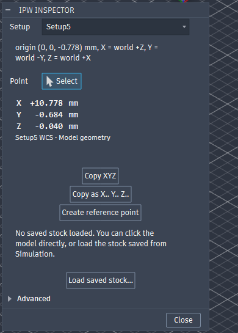
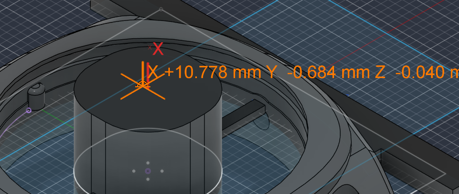

# Fusion IPW Inspector

Inspect Fusion in-process stock and read X, Y, Z coordinates relative to any Manufacturing Setup WCS.

Click a point on the remaining stock (or the model) in the Manufacture workspace and read where it is
in the work coordinate system of the setup you choose, for example the rotary setup that comes next.
Copy the numbers, or drop a reference point there. Nothing else to configure.



## Install (about one minute)

1. Download the latest ZIP from the releases page (or clone this repository).
2. Extract it and copy the `FusionIPWInspector` folder into your Fusion add-ins folder:

   | OS      | Folder |
   |---------|--------|
   | Windows | `%APPDATA%\Autodesk\Autodesk Fusion 360\API\AddIns\` |
   | macOS   | `~/Library/Application Support/Autodesk/Autodesk Fusion 360/API/AddIns/` |

   The result must be `...\AddIns\FusionIPWInspector\FusionIPWInspector.py` (plus the `.manifest`).
3. Restart Fusion (or open **Utilities > Add-Ins > Scripts and Add-Ins**, select *FusionIPWInspector*, click **Run**).
4. Open the **Manufacture** workspace. The **IPW Inspector** button is in the **Inspect** panel, next to Measure.

Windows users can instead run the optional installer from the extracted folder (no administrator rights needed):

```powershell
powershell -ExecutionPolicy Bypass -File .\install.ps1
```

`install.ps1 -Uninstall` removes it again. No Python packages, no network access, no admin rights.

## Use

1. Activate (or just select) the Setup whose WCS you want the numbers in.
2. Click **IPW Inspector**.
3. Click a point on the remaining stock, the model, a face, an edge or a point.
4. Read X, Y, Z. They are relative to the WCS of the setup shown in the **Setup** dropdown.



- **Setup** - change it any time; the reading and the WCS triad update immediately.
- **Copy XYZ** - copies `12.384	-21.750	6.125` (tab separated).
- **Copy as X.. Y.. Z..** - copies `X12.384 Y-21.750 Z6.125` for a controller or a probing cycle.
- **Create reference point** - adds a construction point at the picked location, named with its coordinates,
  so it survives closing the dialog.
- **Load saved stock...** - loads the stock you saved from Simulation (see below) as a temporary mesh you can click on.
- **Advanced** - display unit (document unit, mm or inch), WCS triad on/off, remove the temporary stock,
  diagnostics log. You normally never need it.

Units follow the document (3 decimals in mm, 4 in inches). Values are shown with an explicit sign and never a `-0.000`.

### Getting the in-process stock into the viewport

Fusion shows the simulated remaining stock, but its public API does not expose it (verified against Fusion
2.0.2705x, September 2026, see *Compatibility* below). The only supported way out of Fusion is Simulation's own
**Save Stock**, which writes an STL. IPW Inspector needs that file once per setup; everything after that is automatic:

1. Select the setup that uses the stock (for example Setup 2, *From preceding setup*) and click **Simulate**.
   At the start of the simulation the stock shown *is* the in-process stock left by the preceding setups.
2. Right-click the stock in the viewport, choose **Stock > Save Stock...**, save the STL anywhere.
3. Exit Simulation, open **IPW Inspector**, click **Load saved stock...** and pick the file.

The add-in reads the file, works out its unit and coordinate frame by checking that the stock encloses the setup's
model (STL has no unit; Fusion writes millimetres in world coordinates and this is verified rather than assumed),
imports it as a component named **"IPW Inspector temporary stock (safe to delete)"** and reports what it did in the
dialog. From then on just click on it. The temporary component is removed when you click **Remove temporary stock**,
when the add-in stops, or if you delete it yourself. Loading the same, unchanged file again is instant.

If you only need model geometry (a finished face, a corner, a tab modelled as a body), skip the stock file: any
clickable geometry gives a reading.

## What the numbers mean

`Setup.workCoordinateSystem` gives the setup's WCS as a 4x4 matrix: its three columns are the setup X, Y, Z axes in
world space and its translation is the WCS origin, in **millimetres regardless of document units** (checked by
switching a test document to inches: the matrix does not change). The picked point comes from Fusion's viewport
selection in world space (centimetres, the API's internal unit). The add-in converts both to millimetres and applies

```
p_setup = R^T * (p_world - origin)
```

that is, world to setup, never the other way around. The matrix is validated to be a proper right-handed rigid
transform before it is used; a scaled or mirrored matrix is refused with a message instead of producing wrong numbers.

The coordinate frames Fusion has, and which one you get:

| Frame | Used for |
|-------|----------|
| Design / world | where the picked point comes from and where the stock file is placed |
| Component | not involved (selection points are already in world space) |
| **Setup WCS** | **what is displayed** |
| Machine coordinates, tool orientation, rotary axis | not involved; the WCS is what the post outputs relative to |

For rotary setups the WCS is simply a WCS whose X (or Y) axis happens to be the rotary axis; no special handling
is needed and none is done.

### Accuracy

- Points picked on model geometry are exact.
- Points picked on a saved stock mesh are as accurate as the simulation that produced it (its **Accuracy** setting
  and the STL tessellation). The dialog says "Simulation stock: accuracy depends on simulation resolution" whenever
  the reading comes from a mesh. Three decimals in millimetres are shown because that is what you type into a
  controller; do not read more into the last digit than the simulation resolution supports.

## Verified results

The transform was checked with known geometry inside Fusion 2.0.2705x. World-space picks were taken from the
add-in's diagnostics log and the expected values were computed by hand from the setup WCS matrices.

| Case | Setup WCS (origin mm; axes) | Picked world point (mm) | Expected setup XYZ (mm) | Displayed |
|------|-----------------------------|-------------------------|-------------------------|-----------|
| A - WCS at world origin | (0, 0, 0); X=+X, Y=+Y, Z=+Z | (12.263, 30.000, 8.856) | (12.263, 30.000, 8.856) | +12.263 / +30.000 / +8.856 |
| B - translated (Setup3) | (22, -25.15, 11.822); world axes | (-0.040, 0.684, 10.000) | (-22.040, 25.834, -1.822) | -22.040 / +25.834 / -1.822 |
| C - flipped, rotated 180 about X (Setup2) | (22, 25.15, -13.378); X=+X, Y=-Y, Z=-Z | (-0.040, 0.684, 10.000) | (-22.040, 24.466, -23.378) | -22.040 / +24.466 / -23.378 |
| C' - translated to stock centre | (20, 15, 10.5); world axes | (12.263, 29.999, 8.856) | (-7.737, 14.999, -1.644) | -7.737 / +14.999 / -1.644 |
| D - rotary (Setup5: X = world +Z, Y = world -Y, Z = world +X) | (0, 0, -0.778) | (-0.040, 0.684, 10.000) | (10.778, -0.684, -0.040) | +10.778 / -0.684 / -0.040 |
| D - rotary, second pick | as above | (-2.877, -2.731, 10.000) | (10.778, 2.731, -2.877) | +10.778 / +2.731 / -2.877 |
| Inch display of C' | as above | as above | (-0.3046, 0.5905, -0.0647) in | -0.3046 / +0.5905 / -0.0647 |

The picked world points are the top face of the design's centre island (Z = 10.000 mm exactly), so every Z in
setups B and C and every X in setup D is also checked against known geometry, not only against the transform.
Cases B, C and D were also checked by switching the Setup dropdown with the same pick held; the reading updated
to the values above each time.

Cases C, D and B come from a real four-setup watch-case job (the rotary setup is the one from the motivating
use case); cases A and C' come from a generated test document with a 40 x 30 x 20 mm block. The same block exported
to STL and loaded through **Load saved stock...** was detected as "mm, world coordinates" and a click on the mesh
returned the same point as a click on the solid face underneath it (Y = 30.000 exactly). The pure-Python unit tests
(`FusionIPWInspector/tests`) cover the same cases plus rejection of invalid matrices, formatting, and the stock-file
unit/frame inference (mm, cm, inch, world frame, setup frame, wrong file).

Run the tests with any Python 3:

```bash
python -m unittest discover -s FusionIPWInspector/tests -v
```

## Architecture

```
FusionIPWInspector/
  FusionIPWInspector.py       entry point: run()/stop()
  FusionIPWInspector.manifest
  commands/
    inspector_command.py      the dialog: setup dropdown, pick, readout, buttons
    actions_command.py        document changes (load/remove stock, reference point) as committed actions
  core/
    setup_transform.py        SetupFrame: WCS matrix -> world->setup transform (pure Python)
    point_inspector.py        InspectedPoint: formatting, units, copy formats (pure Python)
    stock_file.py             STL reading, unit + frame inference (pure Python)
    ipw_provider.py           acquisition: temporary stock component, cache, cleanup (Fusion API)
  ui/
    toolbar.py                the one button in Manufacture > Inspect
    markers.py                viewport crosshair, label and WCS triad (custom graphics)
  utils/                      logging, preferences, clipboard, unit conventions
  resources/                  icons
  tests/                      unit tests, no Fusion required
```

The layers are deliberately separated: `setup_transform` and `point_inspector` know nothing about how the stock was
obtained, so if Autodesk exposes the in-process stock directly one day only `ipw_provider` needs replacing.

Two Fusion behaviours shaped the command design and are worth knowing if you change it:

- Anything created while a command dialog is open (custom graphics, imported bodies) belongs to that command's
  transaction. Graphics are therefore drawn in `executePreview`, and document changes are run after the dialog
  closes (through a custom event and a dialog-less helper command) and the dialog reopens where it was.
- `ConstructionPointInput.setByPoint` accepts a bare point only in direct-modelling designs. In parametric designs
  the reference point is anchored to a sketch point in a sketch named "IPW Inspector reference points".

## Compatibility and stability

| Part | Status |
|------|--------|
| Setup WCS transformation (`Setup.workCoordinateSystem`, `Selection.point`) | **Stable**, documented public API |
| Point coordinate inspection, copy, reference point | **Stable**, documented public API |
| Temporary stock import (`MeshBodies.add` in a base feature) | **Stable**, documented public API |
| Toolbar placement in panel `CAMInspectPanel` | Panel id of the Manufacture workspace; falls back to a plain button if the panel moves |
| Save Stock | Fusion's own UI (Simulation context menu). It is **not** scriptable: no command definition exists for it in this build, and the simulation ends as soon as a script runs. The add-in never relies on undocumented command ids or UI automation. |

Tested on Fusion 2.0.2705x (build 2705.1.15, September 2026) on Windows 11 with the bundled Python 3.14.
The manifest allows macOS; the clipboard uses `pbcopy` there. No external Python packages are used.

### What was checked about direct IPW access

The public CAM API of this build (`adsk.cam`) has no property or method that returns the in-process or simulated
stock: `Setup` exposes `stockMode`, `stockSolids` (only for *From solid* stock), `models`, `workCoordinateSystem` and
parameters; `GeneratedDataType` covers additive results only; the command definitions related to stock
(`IronGenerateStock`, `IronInProcessStockDisplay`, `IronAutomaticIPSGeneration`, `IronClearIPSCache`,
`SimulationStockToModel`) drive display features, not data access, and Save Stock has no command definition at all.
When Autodesk adds an accessor, replace `core/ipw_provider.py`.

## Known limitations

- The in-process stock has to be saved once from Simulation (**Stock > Save Stock...**) and loaded with one click.
  Everything else (unit, placement, cleanup) is automatic.
- Readings on a saved stock are limited by the simulation resolution; readings on model geometry are exact.
- Loading the stock and creating a reference point briefly close and reopen the dialog (Fusion requires document
  changes to happen outside the dialog). Your setup choice, unit choice and last pick are kept.
- Only one temporary stock is kept per document at a time; loading another replaces it.
- The picked location is the exact viewport hit under the cursor, not a snapped feature. Use Fusion's snapping
  (vertices, sketch points, construction points are all pickable) when you need a specific feature.

## Troubleshooting

- **No "IPW Inspector" button.** Check that the folder is
  `...\AddIns\FusionIPWInspector\FusionIPWInspector.py`, then Utilities > Add-Ins > Scripts and Add-Ins > select it > Run
  (tick *Run on Startup*). The button lives in the Manufacture workspace only.
- **"This document has no Manufacture data yet."** Create a Setup first.
- **The loaded stock is somewhere else or the wrong size.** The dialog says how the file was read
  (for example "mm, world coordinates"). If it reports that the stock does not enclose the model, the file is probably
  from another setup or another design.
- **Fusion could not import the stock mesh.** Save the stock again as STL from Simulation; OBJ/3MF from other tools
  work too but STL from Fusion is the tested path.
- **Diagnostics.** Advanced > Diagnostics log writes `%LOCALAPPDATA%\FusionIPWInspector\diagnostics.log`
  (`~/Library/Application Support` is not used on macOS; the log goes to your home folder). Errors are always logged.

## Privacy and safety

Runs locally, makes no network requests, collects nothing. It never changes a setup, a WCS or an operation.
The only things it creates are: the temporary stock component (tagged with an attribute so only its own components
are ever removed), reference points you explicitly ask for, and a small preferences file in your local app data folder.

## Contributing

Issues and pull requests are welcome. Keep the core modules Fusion-free so the tests stay runnable anywhere,
keep the dialog small, and add a row to *Verified results* if you touch the transform.

## License

MIT, see `LICENSE`.
